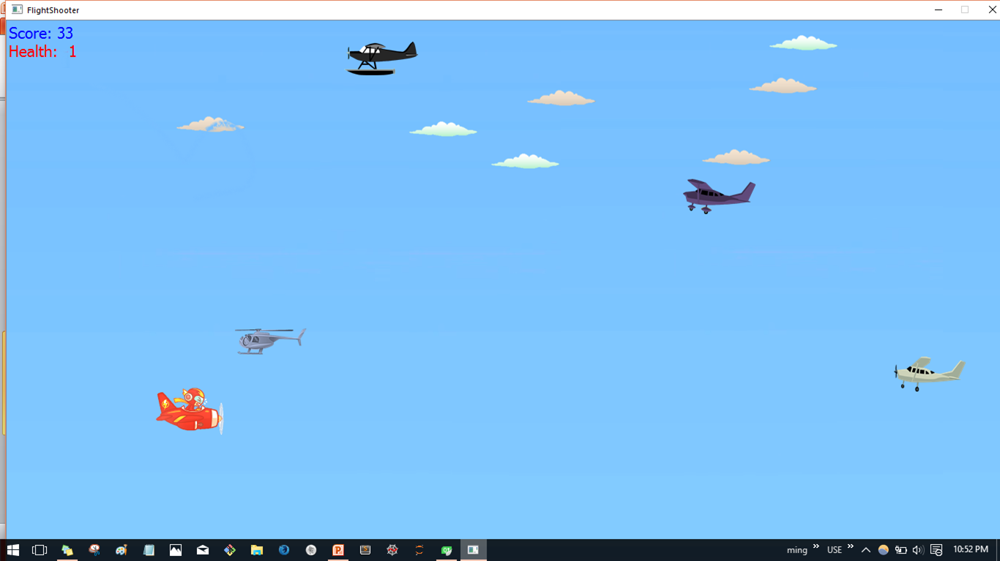
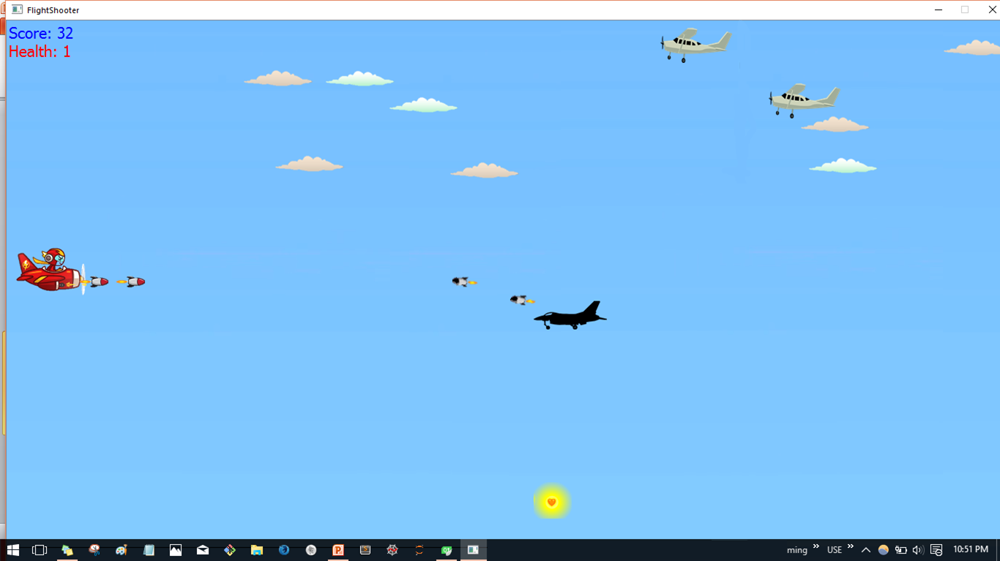

# FlightShooter
Game based on QT library, C++.

#Screenshot

TO DO:

REFACTORING THE CODE

Collision detection for shooting enemy and player

Collision detection for enemy bullet and player

Decrease Health for corresponding parameter.
