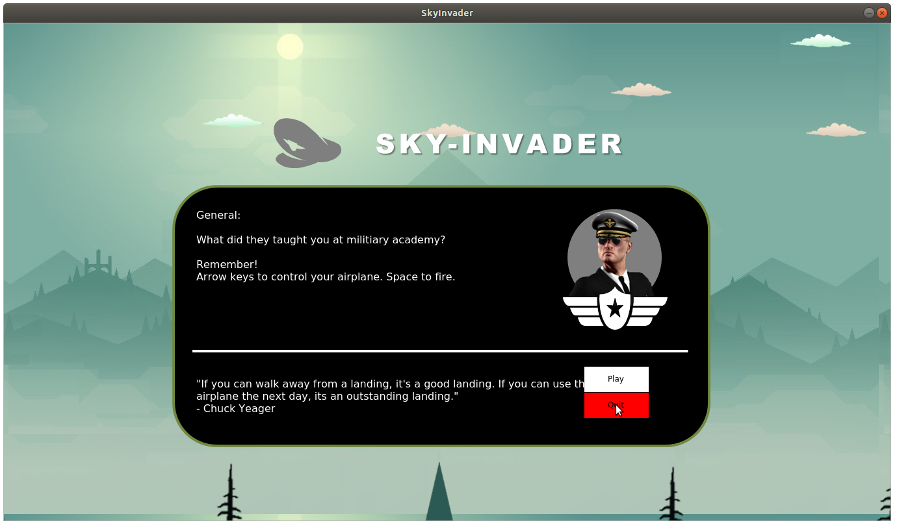
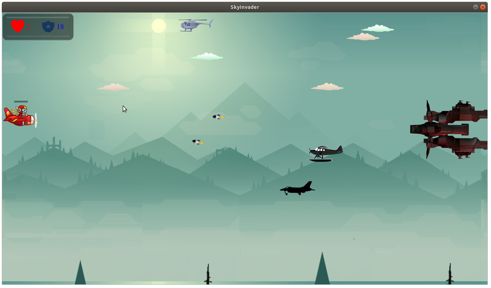
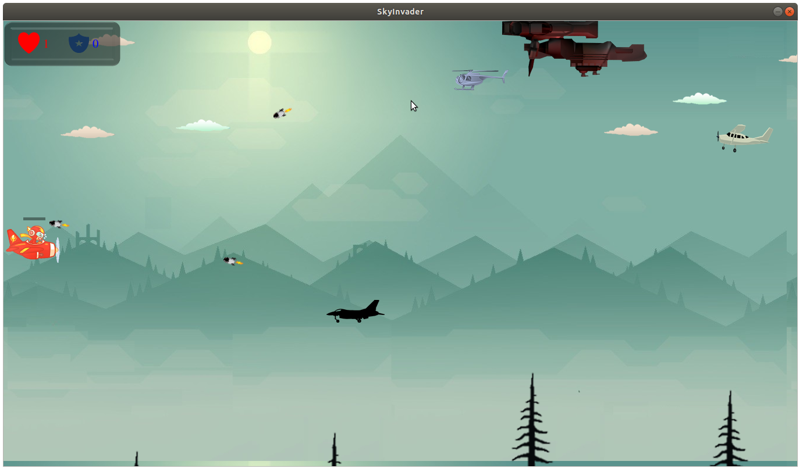

# SkyInvader
SkyInvader is

## Screenshot




## Getting Started

To get the project up and running on your local machine for development and testing purposes

```
Open SkyInvader.pro using QT Creator; build then run
```

### Prerequisites

What things you need to install the software and how to install them

```
1. QtCreator
2. For creating bootloader: grub (linux)
3. gcc compiler

```

### Installing

```
[QT For Windows](https://en.wikipedia.org/wiki/X86_assembly_language)

Linux:
1. nasm -f elf32 kernel/source/kernel.asm -o kernel/objfiles/kerasm.o
2. gcc -m32 -c kernel/source/kernel.c -o kernel/objfiles/kerc.o -ffreestanding
```


## Built With

* [QT](https://en.wikipedia.org/wiki/X86_assembly_language) - Graphics Framework
* [C++ Programming Language](https://en.wikipedia.org/wiki/C_(programming_language))

## Author

* **Sagar Dhungel** - [Journal](https://sagardhungel.com.np/about) - [email](mailto:mail@sagardhungel.com.np)

## ToDos
1. Boss Activity module
2. A lot of things

## License

This project is licensed under the MIT License - see the [LICENSE](https://opensource.org/licenses/MIT) file for details

